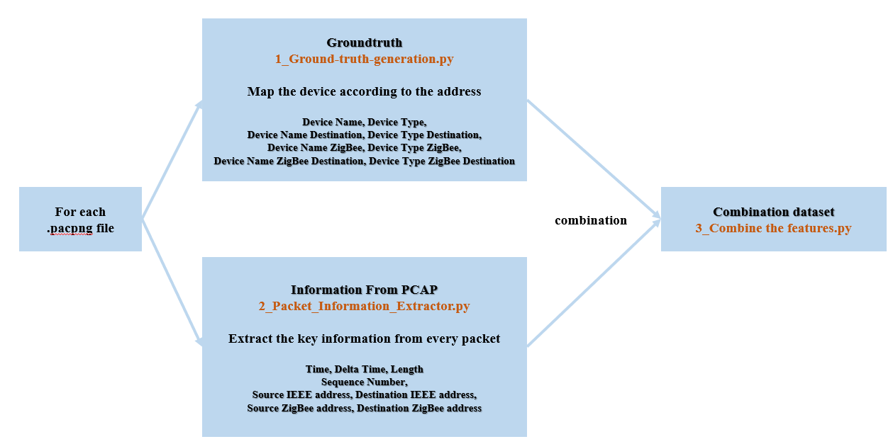
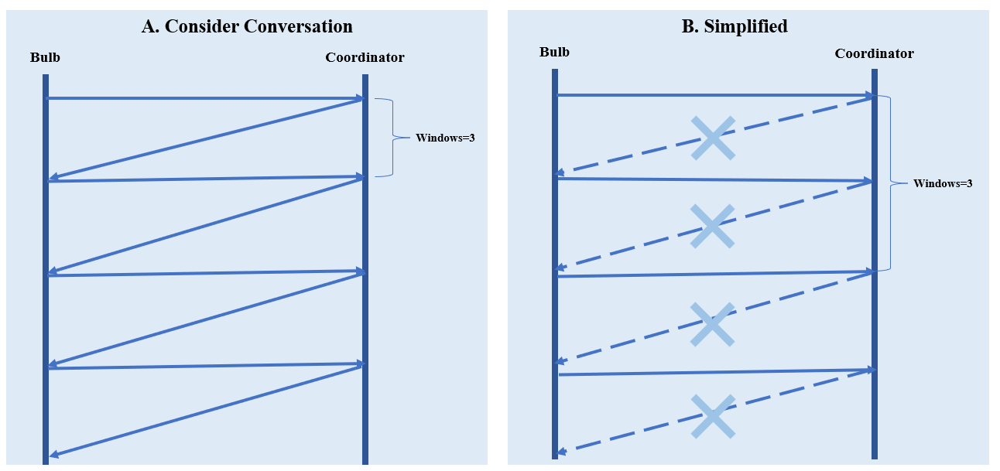
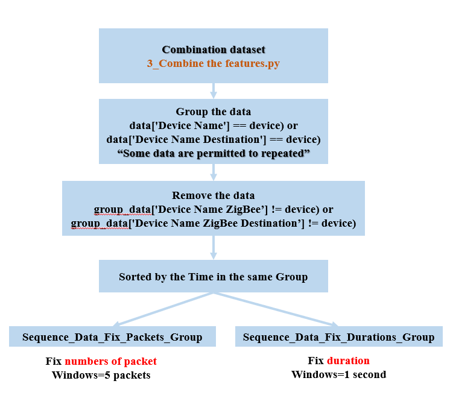
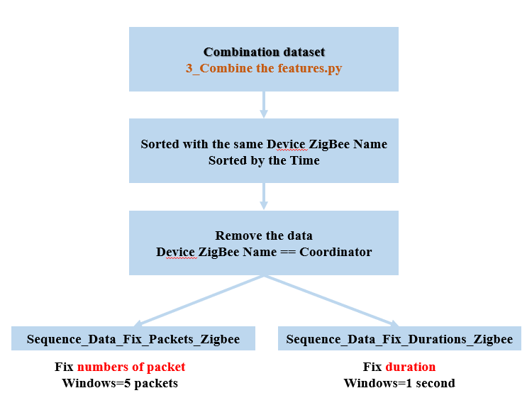

# ZBIOT-2025

Step1: **1_Ground-truth-generation.py** is to Map the device according to the address, get the Device Name, Device Type, Device Name Destination, Device Type Destination, Device Name ZigBee, Device Type ZigBee, Device Name ZigBee Destination, Device Type ZigBee Destination, saved in the file **"1-Groundtruth"**  
Step2: **2_Packet-information-extractor.py** is to extract key information from each packet such as time, length, delta time, sequence number, etc. And saved in the folder **"2-Information_From_PCAP"**  
Step3: **3_Combine-groundtruth-information.py** is combine the information of "1-Groundtruth" and “2-Information_From_PCAP", saved in the folder **"3-Combined_dataset"**  

In this case, we have two methods to generate the new sequence data: Method A is **considering the process of conversation between the devices and coordinator**.  
And another method B is that we simplify the process, we just **focus on the packets from the devices instead of the coordinator**.  

  
**Method A：**  
  
Step4: **A_4_Group-combined-dataset.py** is to group all rows where the 'Device Name' or 'Device Name Destination' matches the specified device. Some data entries may appear multiple times if they meet the filtering conditions. And then **remove all rows where the 'Device Name ZigBee' or 'Device Name ZigBee Destination' doesn't match the device**.  
Step5: **A_5_1_Create-sequence-data-fix-packets.py** is to generate a new sequential dataset by fixing the number of consecutive packets(5 packets) in a sliding window approach, extracting statistical features (e.g., average packet length, sequence number, etc.), and adding device information to generate a new feature datasheet.It is used for subsequent data analysis.The results are stored in the folder "Sequence_Data".  
Step5: **A_5_2-Create-sequence-data-fix-duration.py** is to generate a new sequential dataset by fixing the duration of consecutive packets(1 seconds) in a sliding window approach. The results are stored in the folder "Sequence_Data".  
Step6: **A_6-Merge-and-drop-unknown.py** is to merge the A_5_1-Sequence_Data_Fix_Packets or A_5_2-Sequence_Data_Fix_Duration files of different topologies under "Idle", "Physical_Interaction", "Scenario", "Web_Interaction" and store them in the "Aggregated_Data" folder. And **delete rows containing missing values and the device name "Unknown"**.  

**Method B：**  
  
Step4: **B_4_Sort-clear-combined-dataset.py** is to delete the data for the device named "Coordinator". And sort the data by "Device Name ZigBee" and "Time" in ascending order.  
Step5: **B_5_1_Create-sequence-data-fix-packets.py** is to generate a new sequential dataset by fixing the number of consecutive packets(5 packets) in a sliding window approach, extracting statistical features (e.g., average packet length, sequence number, etc.), and adding device information to generate a new feature datasheet.It is used for subsequent data analysis.The results are stored in the folder "Sequence_Data".  
Step5: **B_5_2-Create-sequence-data-fix-duration.py** is to generate a new sequential dataset by fixing the duration of consecutive packets(1 seconds) in a sliding window approach. The results are stored in the folder "Sequence_Data".  
Step6: **B_6-Merge-and-drop-unknown.py** is to merge the A_5_1-Sequence_Data_Fix_Packets or A_5_2-Sequence_Data_Fix_Duration files of different topologies under "Idle", "Physical_Interaction", "Scenario", "Web_Interaction" and store them in the "Aggregated_Data" folder. And **delete rows containing missing values and the device name "Unknown"**.  

Step8: **8-1_Same_topology.ipynb** is to do the device type classification and name identification of the same topology like train A test A & train B test B including the two type of dataset, one for packets fixed and another for duration fixed.  
Step8: **8-2_Different_topology.ipynb** is to do the device type classification and name identification of the different topologies like train A test B & train B test A including the two type of dataset, one for packets fixed and another for duration fixed.  
